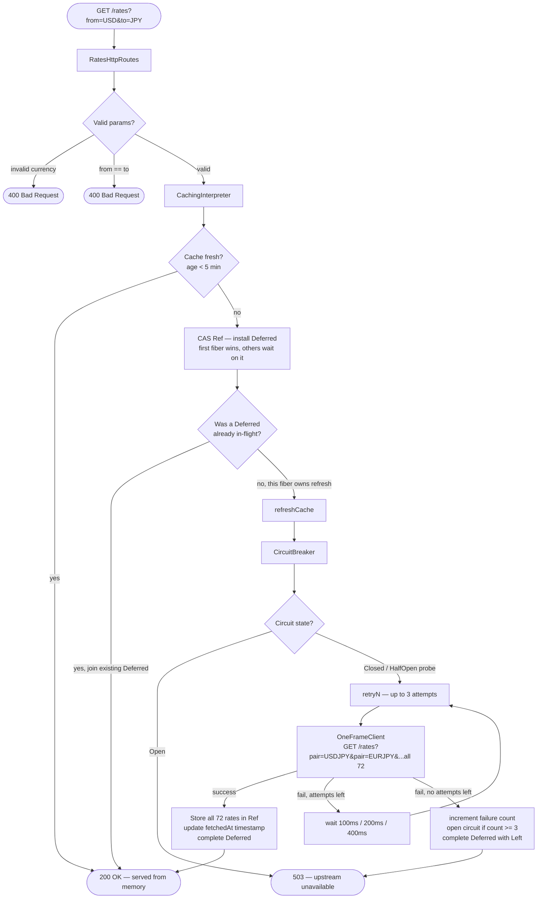
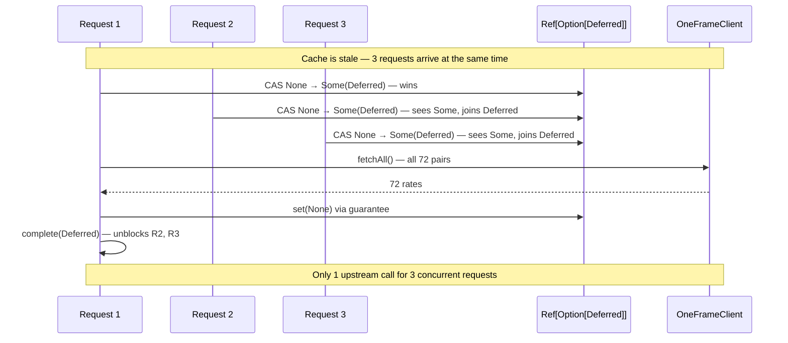
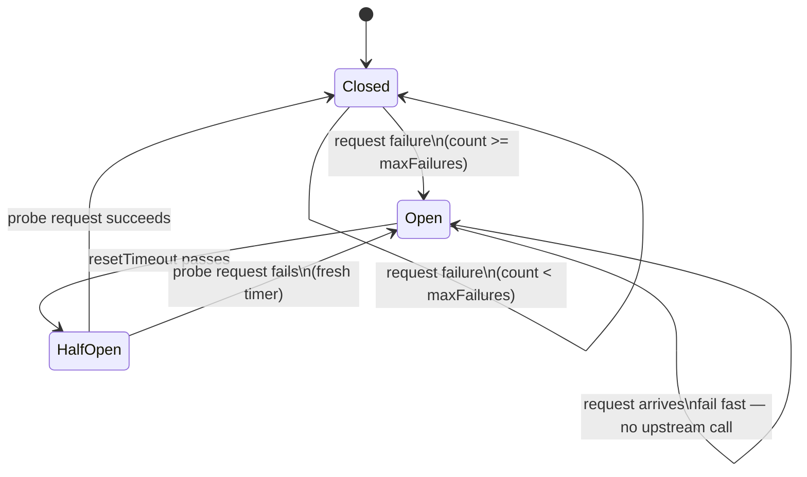
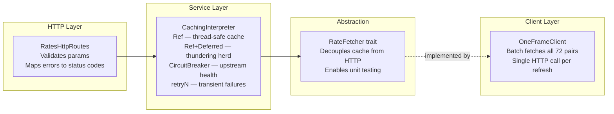

# Forex Proxy — System Design

## Request Flow

---

## Rate Limit Math

| | Value |
|---|---|
| Currencies supported | 9 |
| Pairs (9 × 8, no same-currency) | 72 |
| Cache TTL | 5 minutes |
| Upstream calls per hour | 12 |
| **Upstream calls per day** | **288** |
| One-Frame daily limit | 1,000 |
| Daily requests we can serve | 10,000+ |

288 upstream calls cover 10,000+ user requests because everything else is served from the in-memory cache.

---

## Concurrency Model

---

## Circuit Breaker States

---

## Component Responsibilities

